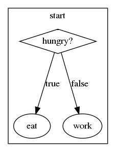
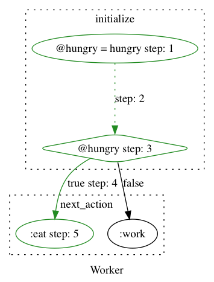
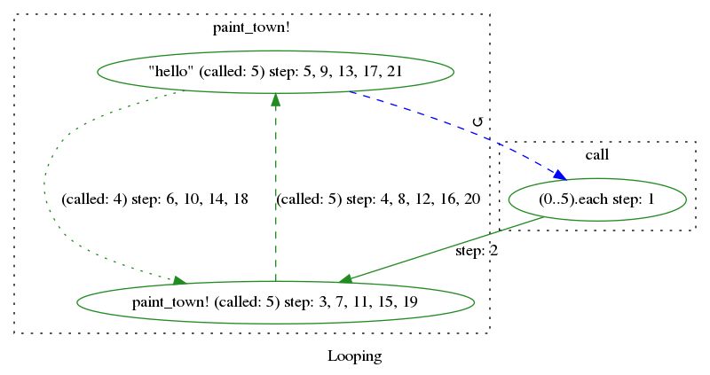
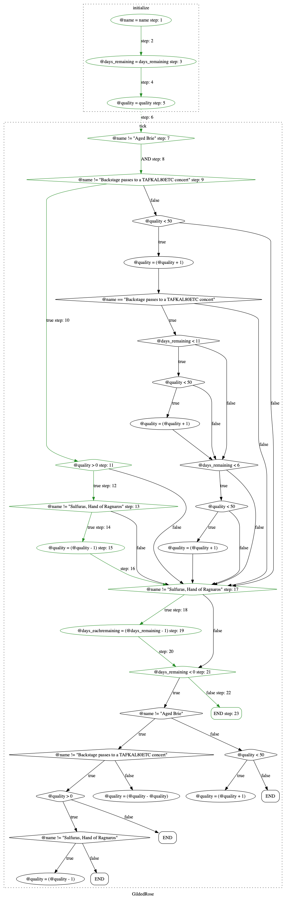

# VisualizeRuby


Write a Ruby code and see method interactions on a flow chart. Works with procedural code, bare methods, and Classes.
This is experimental project and does not support all types of code. 
If you'd like it to support more types of code please pull request.

[Demo](https://visualize-ruby.herokuapp.com/)

## Installation

Add this line to your application's Gemfile:

```ruby
gem 'visualize_ruby'
```

And then execute:

    $ bundle

Or install it yourself as:

    $ gem install visualize_ruby
    
### Install GraphViz

 MacOS

    $ brew install graphviz
    
 Linux
    
    $ sudo apt-get install graphviz

## Usage

### Create a graph by statically parsing the code. 

```ruby
require "visualize_ruby"

ruby_code = <<~RUBY
  if hungry?
    eat
  else
    work
  end
RUBY

results = VisualizeRuby::Builder.new(ruby_code: ruby_code).build
VisualizeRuby::Graphviz.new(results).to_graph(path: "example.png")
```
[](./spec/examples/base_method.png)
### Add an execution path to graph
```ruby
require "visualize_ruby"

ruby_code = <<~RUBY
  class Worker
    def initialize(hungry:)
      @hungry = hungry
    end

    def next_action
      if hungry?
        :eat
      else
        :work
      end
    end

    def hungry?
      @hungry
    end
  end
RUBY

calling_code = <<~RUBY
  Worker.new(hungry: true).next_action
RUBY

VisualizeRuby.new do |vb|
  vb.ruby_code = ruby_code # String, File, Pathname
  vb.trace(calling_code)  # String, File, Pathname, Proc - optional
  vb.output_path = "runner_trace.png" # file name with media extension.
end
```
[](./spec/examples/runner_trace.png)

### Visualize Loops
Adds a count if the node is called more than once.

```ruby
require "visualize_ruby"

ruby_code = <<~RUBY
  class Looping
    def call
      (0..5).each do
        paint_town!
      end
    end

    def paint_town!
      "hello"
    end
  end
RUBY

VisualizeRuby.new do |vb|
  vb.ruby_code = ruby_code # String, File, Pathname
  vb.trace do
    Looping.new.call
  end
  vb.output_path = "loop.png" # file name with media extension.
  # in_line_local_method_calls = true # default, in line method body when calling methods on self. Looks better when tracing execution.
  # only_graphs = ["call"] # When a graph has many sub-graphs only include listed.
  # unique_nodes = true # default, Duplicate nodes with the same description are merged to point single node.
end
```

[](./spec/examples/highlight_tracer_loop.png)

### Complex unrefactored code example
[Gilded Rose](https://github.com/amckinnell/Gilded-Rose-Ruby)

[](./spec/examples/gilded_rose.png)


## Development

After checking out the repo, run `bin/setup` to install dependencies. Then, run `rake spec` to run the tests. You can also run `bin/console` for an interactive prompt that will allow you to experiment.

To install this gem onto your local machine, run `bundle exec rake install`. To release a new version, update the version number in `version.rb`, and then run `bundle exec rake release`, which will create a git tag for the version, push git commits and tags, and push the `.gem` file to [rubygems.org](https://rubygems.org).

## Contributing

Bug reports and pull requests are welcome on GitHub at https://github.com/zeisler/visualize_ruby. This project is intended to be a safe, welcoming space for collaboration, and contributors are expected to adhere to the [Contributor Covenant](http://contributor-covenant.org) code of conduct.

## License

The gem is available as open source under the terms of the [MIT License](https://opensource.org/licenses/MIT).

## Code of Conduct

Everyone interacting in the VisualizeRuby project’s codebases, issue trackers, chat rooms and mailing lists is expected to follow the [code of conduct](https://github.com/zeisler/visualize_ruby/blob/master/CODE_OF_CONDUCT.md).
